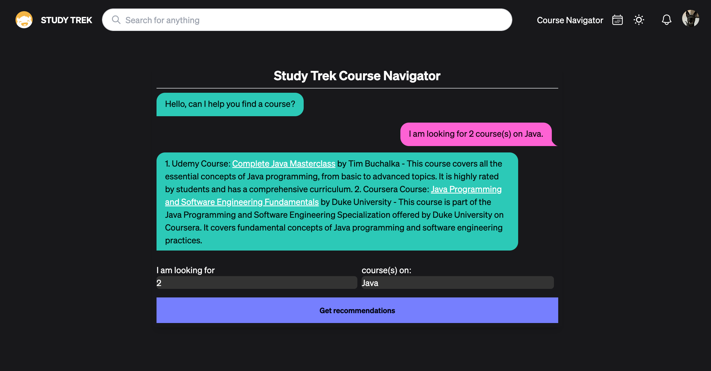
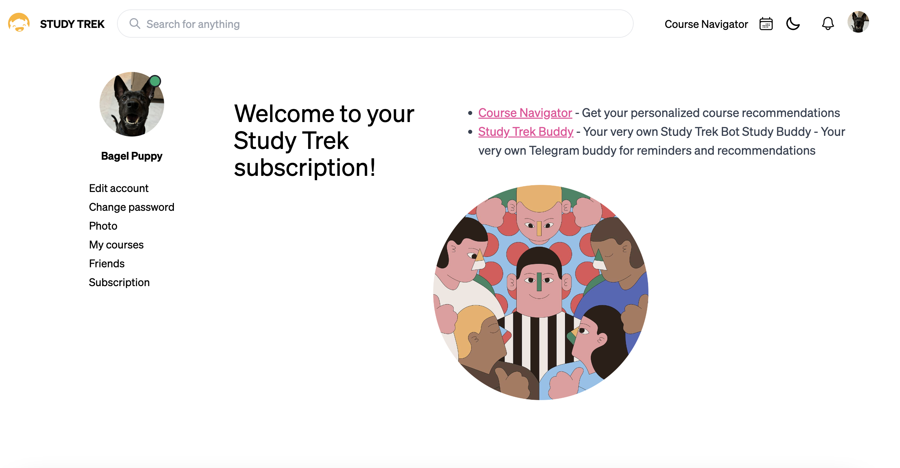

# Study Trek

<p align="left">
  
</p>

Study Trek is an educational platform designed to help users navigate their learning journey efficiently. Built with Angular for the frontend and Spring Boot for the backend, we offer a robust solution for managing courses across various education platforms and study materials. We foster a community-centric approach, allowing users to add friends and engage in discussions via a forum, promoting collaborative learning.

## Table of Contents
- [Main Features](#main-features)
- [Premium Membership](#premium-membership)
- [Security Features](#security-features)
- [Usage](#usage)
- [Technologies](#technologies)
- [Image Credits](#image-credits)

## Main Features
- **🔎 Course Search**: Gain access to 50,000+ courses from Udemy and Coursera in tech, design, and business, all in one place. 
- **💻 Study Hub Forum**: Engage in discussions with a community of learners.
- **👭 Find Your Friends**: If you want to go far, go together; add friends to see what they're learning.
- **💯 Progress Tracker**: Check off lectures to track course progress.
- **📝 Note Taker**: Add personalised notes for all courses taken.
- **🗓️ Interactive Calendar**: Plan and schedule study sessions and course deadlines efficiently.
- **🌚 Dark Mode Toggle**: Alleviating eye strain 👀. Also, it just looks better.
- **💳 Stripe Integration**: Make payments safely and securely using Stripe API. 

## Premium Features
- **🤖 AI Course Navigator**: Get personalised course recommendations powered by OpenAI.
- **💬 Study Buddy Telegram Bot**: A bot to send reminders and for accessing Course Navigator at your fingertips.

## Security and Performance Features
- **Authentication and Authorization**: Utilizes JWT for secure authentication and authorization to protect user sessions and sensitive data.
- **Data Encryption**: Sensitive user data is encrypted using hashing to ensure privacy and security.
- **Caffine Cache**: High-performance caching library to reduce calls to external APIs, improving loading times and app performance.


## Screenshots
<p align="left">
  
</p>
<p align="left">
  
</p>
<p align="left">
  
</p>
<p align="left">
  
</p>
<p align="left">
  
</p>

## Usage 

### Prerequisites
- Node.js
- Angular CLI
- Java JDK 11+
- Maven

### Backend Setup
```bash
cd backend
mvn spring-boot:run
```

### Technologies
- **Tailwind CSS**: [Visit Tailwind CSS](https://tailwindcss.com/)
- **Angular Material**: [Visit Angular Material](https://material.angular.io/)
- **DaisyUI**: [Visit DaisyUI](https://daisyui.com/)

### Image Credits
- Illustrations by Camilo Huinca: [Profile](https://agentpekka.com/artist/camilo-huinca/)